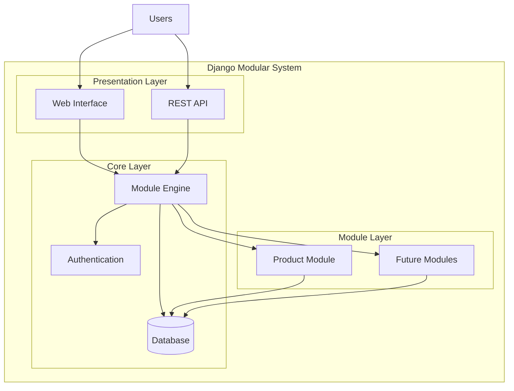
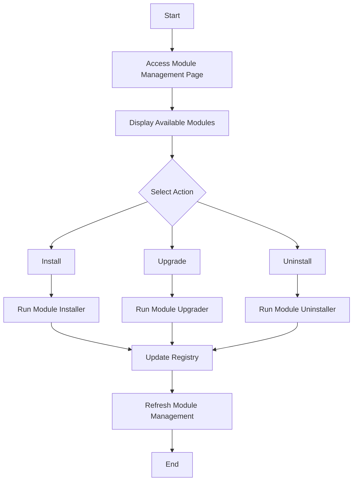
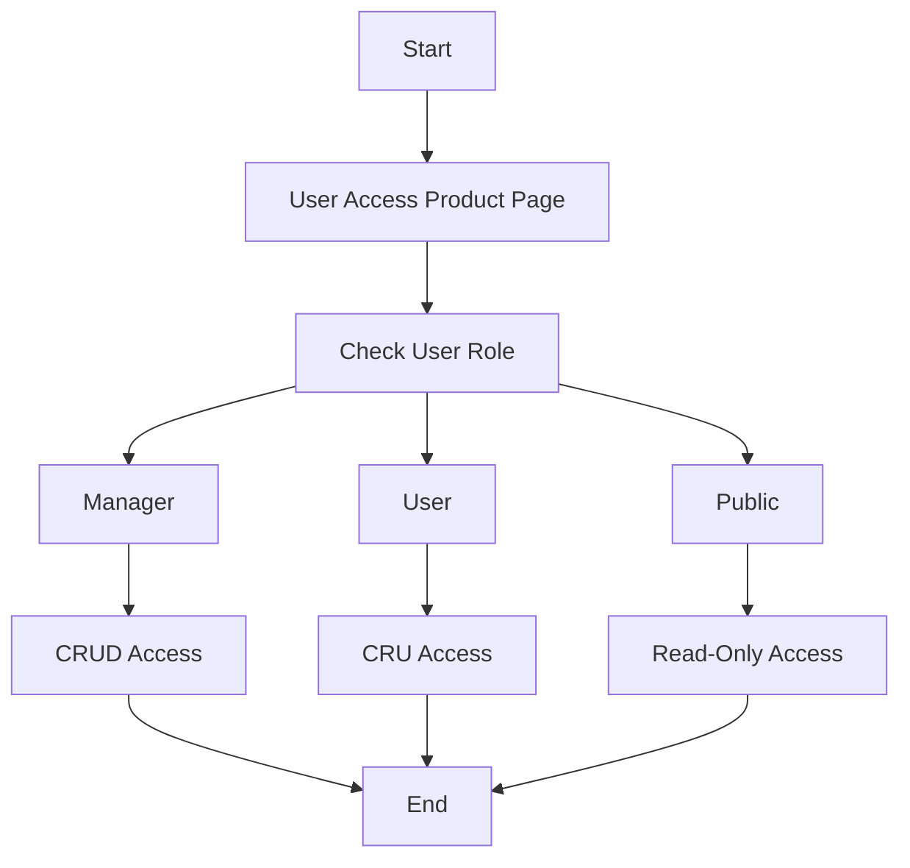
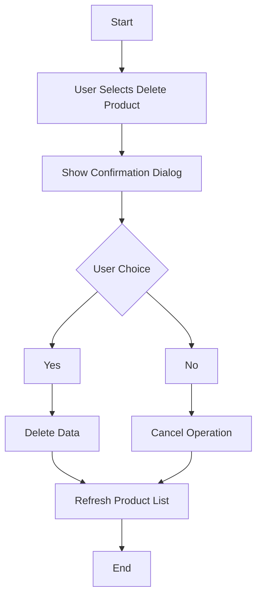

# Django Modular System

[](https://www.djangoproject.com/)
[](https://www.python.org/)
[](LICENSE)
[](https://www.postgresql.org/)

A powerful Django-based modular system that enables dynamic installation, upgrading, and uninstallation of application modules. This system provides a flexible architecture for building extensible web applications with role-based access control.

## 🚀 Features

### Core Functionality
- **Dynamic Module Management**: Install, upgrade, and uninstall modules without restarting the application
- **Role-Based Access Control**: Granular permissions system with Manager, User, and Public roles
- **Module Registry**: Centralized tracking of module states and metadata
- **Database Migrations**: Automated handling of schema changes during module operations
- **Confirmation Dialogs**: User-friendly confirmation prompts for destructive operations

### Technical Highlights
- **RESTful Architecture**: Clean URL patterns and HTTP methods
- **Template Inheritance**: Consistent UI across all modules
- **Signal-based Registration**: Automatic module discovery and registration
- **Environment Configuration**: Flexible settings for development and production
- **Static File Management**: Optimized asset handling with WhiteNoise

## 📋 Table of Contents

- [Architecture](#-architecture)
- [Quick Start](#-quick-start)
- [Installation](#-installation)
- [Configuration](#-configuration)  
- [Usage](#-usage)
- [Module Development](#-module-development)
- [API Reference](#-api-reference)
- [Deployment](#-deployment)
- [Contributing](#-contributing)

## 🏗️ Architecture

The Django Modular System is built around two core components:

### Module Engine (`module_engine`)
The central orchestrator that manages the lifecycle of all modules:
- **Module Registry**: Tracks installation status, versions, and metadata
- **Installation Manager**: Handles module installation and dependency resolution
- **Migration Controller**: Manages database schema changes
- **Access Controller**: Enforces module-level access restrictions

### Product Module (`product_module`)
A reference implementation demonstrating the modular architecture:
- **CRUD Operations**: Complete Create, Read, Update, Delete functionality
- **Role-based Views**: Different interfaces based on user permissions
- **Data Validation**: Comprehensive input validation and sanitization
- **Audit Trail**: Automatic tracking of creation and modification dates

### System Architecture Diagram



## 📁 Project Structure

```txt
django_modular_project/
├── manage.py                     # Django management script
├── django_modular_project/       # Project configuration
│   ├── __init__.py
│   ├── settings.py              # Django settings
│   ├── urls.py                  # Root URL configuration
│   ├── asgi.py                  # ASGI configuration
│   └── wsgi.py                  # WSGI configuration
├── module_engine/               # Core module management
│   ├── __init__.py
│   ├── admin.py                 # Admin interface
│   ├── apps.py                  # App configuration
│   ├── migrations/              # Database migrations
│   ├── models.py                # Data models
│   ├── templates/               # HTML templates
│   │   └── module_engine/
│   │       ├── module_list.html
│   │       └── module_detail.html
│   ├── templatetags/            # Custom template tags
│   │   ├── __init__.py
│   │   └── module_tags.py
│   ├── urls.py                  # URL routing
│   ├── views.py                 # View controllers
│   └── signals.py               # Signal handlers
└── product_module/              # Example module implementation
    ├── __init__.py
    ├── admin.py                 # Product admin
    ├── apps.py                  # App configuration
    ├── installer.py             # Module installer
    ├── migrations/              # Database migrations
    ├── models.py                # Product models
    ├── templates/               # Product templates
    │   └── product_module/
    │       ├── product_list.html
    │       ├── product_create.html
    │       ├── product_update.html
    │       └── product_detail.html
    ├── urls.py                  # Product URLs
    └── views.py                 # Product views
```

## 🚀 Quick Start

Get the Django Modular System running in under 5 minutes:

```bash
# Clone the repository
git clone https://github.com/ridwaanhall/django-app-modular.git
cd django-app-modular

# Create virtual environment
python -m venv venv
source venv/bin/activate  # On Windows: venv\Scripts\activate

# Install dependencies
pip install -r requirements.txt

# Configure environment
echo "SECRET_KEY=your-secret-key-here" > .env
echo "DEBUG=True" >> .env

# Setup database
python manage.py migrate

# Create superuser
python manage.py createsuperuser

# Run development server
python manage.py runserver
```

Visit `http://127.0.0.1:8000` to access the application.

## 📦 Installation

### Prerequisites

- Python 3.8 or higher
- pip (Python package manager)
- Virtual environment (recommended)
- PostgreSQL (for production) or SQLite (for development)

### Detailed Installation Steps

1. **Clone and Setup Environment**
   ```bash
   git clone https://github.com/ridwaanhall/django-app-modular.git
   cd django-app-modular
   python -m venv venv
   source venv/bin/activate
   ```

2. **Install Dependencies**
   ```bash
   pip install -r requirements.txt
   ```

3. **Environment Configuration**
   Create a `.env` file in the project root:
   ```env
   SECRET_KEY=your-secret-key-here
   DEBUG=True
   # For development (SQLite is used by default)
   # For production with PostgreSQL:
   # DATABASE=your_db_name
   # USER=your_db_user
   # PASSWORD=your_db_password
   # HOST=your_db_host
   ```

4. **Database Setup**
   ```bash
   python manage.py makemigrations
   python manage.py migrate
   python manage.py createsuperuser
   ```

5. **Static Files Collection (Production)**
   ```bash
   python manage.py collectstatic
   ```

## ⚙️ Configuration

### Environment Variables

| Variable | Description | Default | Required |
|----------|-------------|---------|----------|
| `SECRET_KEY` | Django secret key | - | Yes |
| `DEBUG` | Debug mode flag | `False` | No |
| `DATABASE` | Database name | - | Production |
| `USER` | Database user | - | Production |
| `PASSWORD` | Database password | - | Production |
| `HOST` | Database host | - | Production |

### Database Configuration

#### Development (SQLite)
The system uses SQLite by default for development. No additional configuration required.

#### Production (PostgreSQL)
For production deployments, configure PostgreSQL by setting environment variables in `.env` file.

## 🎯 Usage

### User Roles and Permissions

The system implements three distinct user roles:

| Role | Permissions | Description |
|------|-------------|-------------|
| **Manager** | CRUD | Full access - Create, Read, Update, Delete |
| **User** | CRU | Limited access - Create, Read, Update |
| **Public** | R | Read-only access |

### Getting Started

1. **Login**
   - Access `http://127.0.0.1:8000/admin/` for admin interface
   - Use the superuser credentials you created during setup

2. **Module Management**
   - Navigate to `http://127.0.0.1:8000/` to view available modules
   - Install the Product Module to see the system in action

3. **Product Management** 
   - After installing the Product Module, visit `http://127.0.0.1:8000/product/`
   - Test different user roles to see permission-based interfaces

### Module Management Workflows

#### 1. Module Installation Flow



#### 2. Role-based Access Control Flow



#### 3. Delete Confirmation Flow



## 🔧 Module Development

Create new modules following the established pattern:

### 1. Create Module Structure

```bash
python manage.py startapp your_module_name
```

### 2. Implement Required Files

#### `models.py`
```python
from django.db import models

class YourModel(models.Model):
    name = models.CharField(max_length=200)
    created_at = models.DateTimeField(auto_now_add=True)
    updated_at = models.DateTimeField(auto_now=True)
    
    def __str__(self):
        return self.name
```

#### `installer.py`
```python
from django.utils import timezone
from module_engine.models import ModuleRegistry

def install():
    """Install the module"""
    # Perform installation tasks
    pass

def upgrade():
    """Upgrade the module"""
    module = ModuleRegistry.objects.get(name='your_module_name')
    module.version = '1.0.1'
    module.update_date = timezone.now()
    module.save()

def uninstall():
    """Uninstall the module"""
    # Perform cleanup tasks
    pass
```

#### `signals.py`
```python
from django.db.models.signals import post_migrate
from django.dispatch import receiver
from module_engine.models import ModuleRegistry

@receiver(post_migrate)
def register_module(sender, **kwargs):
    if sender.name == 'your_module_name':
        ModuleRegistry.objects.get_or_create(
            name='your_module_name',
            defaults={'version': '1.0.0'}
        )
```

### 3. Update Settings

Add your module to `INSTALLED_APPS` in `settings.py`:
```python
INSTALLED_APPS = [
    # ... other apps
    'your_module_name',
]
```

## 📚 API Reference

### Module Engine Endpoints

| Endpoint | Method | Description |
|----------|--------|-------------|
| `/` | GET | List all modules |
| `/install/<module_name>/` | POST | Install module |
| `/upgrade/<module_name>/` | POST | Upgrade module |
| `/uninstall/<module_name>/` | POST | Uninstall module |

### Product Module Endpoints

| Endpoint | Method | Description |
|----------|--------|-------------|
| `/product/` | GET | List products |
| `/product/create/` | GET, POST | Create product |
| `/product/<id>/` | GET | View product |
| `/product/<id>/edit/` | GET, POST | Edit product |
| `/product/<id>/delete/` | POST | Delete product |

### Core Models

#### ModuleRegistry
```python
class ModuleRegistry(models.Model):
    name = models.CharField(max_length=100)
    version = models.CharField(max_length=20)
    installed = models.BooleanField(default=False)
    enabled = models.BooleanField(default=False)
    install_date = models.DateTimeField(null=True, blank=True)
    update_date = models.DateTimeField(null=True, blank=True)
    metadata = models.JSONField(default=dict)
```

#### Product
```python
class Product(models.Model):
    name = models.CharField(max_length=200)
    barcode = models.CharField(max_length=50, unique=True)
    price = models.DecimalField(max_digits=10, decimal_places=2)
    stock = models.IntegerField(default=0)
    created_at = models.DateTimeField(auto_now_add=True)
    updated_at = models.DateTimeField(auto_now=True)
```

## 🚀 Deployment

### Production Checklist

- [ ] Set `DEBUG=False` in environment
- [ ] Configure PostgreSQL database
- [ ] Set up proper `SECRET_KEY`
- [ ] Configure static file serving
- [ ] Set up SSL certificates
- [ ] Configure logging
- [ ] Set up monitoring

### Vercel Deployment

The project includes Vercel configuration (`vercel.json`):

```bash
vercel --prod
```

### Docker Deployment

Create `Dockerfile`:
```dockerfile
FROM python:3.11-slim

WORKDIR /app
COPY requirements.txt .
RUN pip install -r requirements.txt

COPY . .
RUN python manage.py collectstatic --noinput

EXPOSE 8000
CMD ["gunicorn", "django_modular_project.wsgi:application", "--bind", "0.0.0.0:8000"]
```

## 🤝 Contributing

We welcome contributions! Please follow these steps:

### Development Setup

1. Fork the repository
2. Create a feature branch (`git checkout -b feature/amazing-feature`)
3. Make your changes
4. Add tests for new functionality
5. Run the test suite (`python manage.py test`)
6. Commit your changes (`git commit -m 'Add amazing feature'`)
7. Push to the branch (`git push origin feature/amazing-feature`)
8. Open a Pull Request

### Code Standards

- Follow PEP 8 style guidelines
- Write comprehensive docstrings
- Add unit tests for new features
- Update documentation as needed

## 📄 License

This project is licensed under the MIT License - see the [LICENSE](LICENSE) file for details.

## 📞 Support

- **Documentation**: [Repository Wiki](https://github.com/ridwaanhall/django-app-modular/wiki)
- **Issues**: [GitHub Issues](https://github.com/ridwaanhall/django-app-modular/issues)
- **Discussions**: [GitHub Discussions](https://github.com/ridwaanhall/django-app-modular/discussions)

---

**Built with ❤️ by [Ridwan Hall](https://github.com/ridwaanhall)**
